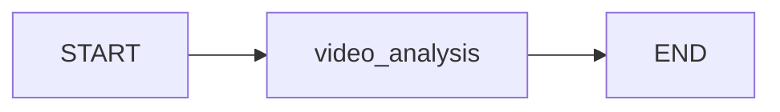

# TiktokChef API

A FastAPI application that extracts structured recipes from cooking videos using AI and LangGraph.

## Features

- 🎥 Extract recipes from cooking video URLs
- 🤖 AI-powered recipe analysis using Google Gemini
- 📊 Structured recipe data with ingredients and instructions
- ✅ Recipe validation and error handling
- 🚀 RESTful API with OpenAPI documentation

## System Architecture



## Getting Started

### Prerequisites

- Python 3.12+
- Google Gemini API key

### 1. Install `uv` (Package Manager)

**macOS/Linux:**

```bash
curl -LsSf https://astral.sh/uv/install.sh | sh
```

**Windows:**

```powershell
powershell -c "irm https://astral.sh/uv/install.ps1 | iex"
```

### 2. Installation

```bash
# Install dependencies
uv sync
```

### Setup Environment

Create a `.env` file with your API keys:

```env
GEMINI_API_KEY=your_gemini_api_key_here
```

### Run the API

```bash
# Start the development server
uv run python -m uvicorn main:app --reload --host 0.0.0.0 --port 8000

# Or with python directly
uvicorn main:app --reload --host 0.0.0.0 --port 8000
```

The API will be available at `http://localhost:8000`

## API Endpoints

### Health Check

- `GET /` - Basic health status
- `GET /health` - Detailed health information

### TiktokChef API

- `POST /extract` - Extract recipe from video URL
- `GET /extract/demo` - Demo extraction with sample video

### Example Usage

```bash
# Extract recipe from a video
curl -X POST "http://localhost:8000/extract" \
  -H "Content-Type: application/json" \
  -d '{
    "video_url": "https://www.tiktok.com/@khanhong/video/7557275818255273234",
    "max_retries": 2
  }'

# Try the demo endpoint
curl "http://localhost:8000/extract/demo"
```

### Response Format

```json
{
  "success": true,
  "recipe": {
    "recipe_overview": {
      "title": "Recipe Title",
      "prep_time": "15 mins",
      "cook_time": "30 mins",
      "servings": 4,
      "difficulty": "Easy",
      "cuisine_type": "Italian"
    },
    "ingredients": [
      {
        "item": "Pasta",
        "amount": "200",
        "unit": "g",
        "notes": null
      }
    ],
    "instructions": [
      "Boil water in a large pot",
      "Add pasta and cook according to package directions"
    ],
    "equipment": ["Large pot", "Colander"]
  },
  "metadata": {
    "steps": 2,
    "is_valid": true,
    "errors": null
  },
  "processing_time": 3.45
}
```

## Documentation

- **Swagger UI**: `http://localhost:8000/docs`
- **ReDoc**: `http://localhost:8000/redoc`
- **OpenAPI JSON**: `http://localhost:8000/openapi.json`

## Development

### Running Tests

```bash
# Test the API endpoints
uv run python tests/test_api.py
```

### Project Structure

```
recipe-app/
├── main.py              # FastAPI application
├── src/
│   ├── agent.py        # TiktokChef agent
│   ├── config.py       # Configuration and prompts
│   ├── graph.py        # LangGraph workflow
│   ├── schema.py       # Pydantic models
│   └── tools.py        # AI tools and functions
├── tests/
│   └── test_api.py     # API test script
└── README.md           # This file
```

## 🐳 Docker Workflow

For production or containerized environments:

| Action    | Command                                     |
| --------- | ------------------------------------------- |
| **Build** | `docker build -t tiktokchef .`              |
| **Run**   | `docker run -p 8000:8000 tiktokchef`        |
| **Test**  | `curl http://localhost:8000`                |
| **Clean** | `docker stop <id> && docker rmi tiktokchef` |
